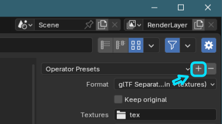

# Asset Exporter

### A Blender 4.1+ addon for quickly exporting collections to glTF and FBX

This addon was written to speed up exporting assets for use with various pipelines. It allows you to export multiple assets at once with a single click, by grouping them into collections.

 It started as a way to quickly export glTF asset for Decentraland. It has since been adapted to support FBX, with some features for Roblox development.

### Features

- One-click, batch export to either glTF or FBX
- Choose from existing Export Operator Presets
- Export multiple collections at once
- Export NLA tracks to individual files (for use with Roblox)

## Getting started

- Download the [latest version from the Releases page](https://github.com/stom66/blender-asset-exporter/releases/latest)
- Install it in Blender Preferences -> Add-ons -> Menu -> Install from disk
- Once installed ensure the plugin is activated (ticked) in the list of Addons

The plugin panel can be found in *3D Viewport -> Sidebar -> Asset Exporter*

How to use:
--

* Place your objects in a collection 
* Name the collection, using the prefix specified in the Asset Exporter panel. For example, with the Collection Prefix set to the default value of "_export.":
    * `_export.robotArm`
    * `_export.rock.small`
    * `_export.rock.large`

* Set the output path in the Asset Exporter by clicking the folder icon
    * A relative path should be specified, starting with `//` 

* For FBX:
    * Choose an FBX export preset - see [Creating export operator presets](#creating-export-operator-presets)
    * (Optional) Toggle "Split NLA tracks" [[why?]](#fbx-split-nla-tracks)
    * Click `Export to FBX`

* For glTF:
    * Choose a glTF export preset - see [Creating export operator presets](#creating-export-operator-presets)
    * Select the format to use: glTF or GLB
    * (Optional) Toggle Draco compression. Note that not all 3D apps support this
    * Click `Export to glTF`

## Export Operator Presets

"Operator Presets" are a way of saving export settings so that they can easily be re-used. Blender supports this by default, and the Asset Exporter Addon requires there to be at least one Export Operator Preset that it can use for exports.

If your

### Creating an Operator Preset

* File -> Export -> glTF 2.0 (.glb/.gltf)  
    **OR**    
* File -> Export -> FBX (.fbx)
* Configure the export settings you would like to use
* At the top-right, next to the "Operator Presets" dropdown, click the + icon
* Enter a name for your Preset
* Click OK

You may click Cancel and return to the Viewport, the profile will have been saved and can now be selected in the Asset Exporter panel.

Notes: 

- The "Use Selection", "Use Visible" and other filtering settings are ignored - these are over-ridden by the plugin to "Use Collection", as this is how the exporter works.
- For glTF, Draco compression settings are over-ridden by the toggle in the Asset Exporter panel

### Updating an Operator Presets

* Select the Preset from the dropdown of Operator Presets
* Change the settings you wish to change
* At the top-right, next to the "Operator Presets" dropdown, click the + icon
* Enter the current preset name
* Click OK to save and overwrite the old Preset

## Tips

#### Multiple collections per file

This is supported, and was the original reason for creating this Addon. My own workflow regularly has a number of assets in the same source file which need to be exported to their own files.

Place each asset in its own collection. They will all be exported with a single click.

To temporarily stop a collection from being exported you can disable it by unticking it:

#### FBX: Split NLA tracks

This is useful for Roblox where models must contain a single animation per file. If enabled, this will cause the exporter to produce multiple FBX files for the collection, each containing a single NLA track. 

For example, a collection named `_export.robotArm` containing an Armature with 3 NLA tracks `wave`, `spin` and `thumbsUp` would produce the files:

- `robotArm.fbx` - this contains the armature, meshes, and all animatioms in a single file
- `robotArm.wave.fbx` - just the armature and the `wave` NLA track
- `robotArm.spin.fbx` - just the armature and the `spin` NLA track
- `robotArm.thumbsUp.fbx` - just the armature and the `thumbsUp` NLA track

## Troubleshooting

- #### Nothing happens when you export

    Look at the status bar for more info. Common mistakes to check:
    
    - Ensure you have a valid Export Operator Preset selected in the dropdown.
    - Ensure you have a collection with the correct prefix
    - Ensure you have select a valid output path

- #### You get an error when trying to export

    This is usually caused by trying to export with an old Export Operator Preset. Make a new one and be sure to Load Operator Defaults first so that none of the old settings carry over.

- #### Exporting to glTF with the export option "Apply Modifiers" triggers a warning "Cannot assign a 'IDPropertyGroup' value to the existing 'hops' Group IDProperty"

    This seems to be a bug with the current version of HardOps/HOps. You can fix this by removing the Smooth by Angle modifier from your asset, or enabling the option to remove them automatically in the Asset Exporter options.

- #### You get an error ending with "context is incorrect"

This is usually due to trying to export when in an armatures Pose mode. Switch to object mode before exporting.

    

## ToDo

- [x] Add in option to move objects to world origin during export
- [x] Better status indicators  
- [ ] Add ability to export JSON file to accompany split FBX files, for use with Lune and other Roblox toolchain scripts.